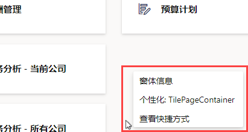
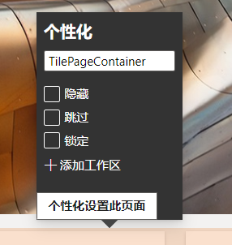
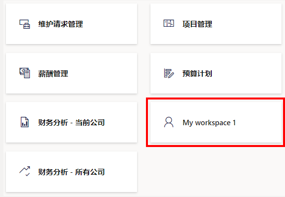
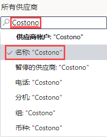
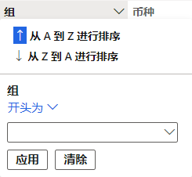
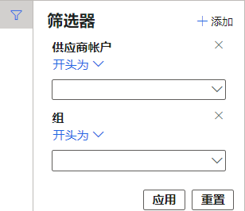
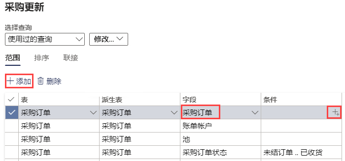
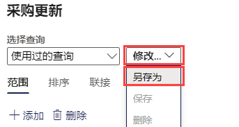

---
lab:
    title: '实验室 2：探索工作区和筛选功能'
    module: '模块 1：学习 Microsoft Dynamics 365 Supply Chain Management 的基础知识'
---

# 模块 1：学习 Microsoft Dynamics 365 Supply Chain Management 的基础知识

## 实验室 2 - 探索工作区和筛选功能

## 目标

当你首次登录财务和运营时，可以使用许多内置工作区。此外，还可以创建自己的工作区，其中的内容侧重于你可能需要的内容。工作区是 Dynamics 365 的众多功能之一，但你也应该知道，筛选才是真正可获取要查找的特定项的方法。你必须创建新的个性化工作区，并使用筛选功能来识别所需的不同项。

## 实验室设置

   - **预计用时**： 10 分钟

## 说明

1. 在财务和运营主页上的“工作区”磁贴右侧，右键单击或点击并按住空白区域以触发菜单。

    

1. 在菜单中，选择 **“个性化设置: TilePageContainer”**。

1. 在“个性化设置”窗口中，选择 **“+ 添加工作区”**。

1. 如果未显示小型的“个性化设置”窗口，请尝试在主页上向上滚动，右键单击或点击并按住，然后再次选择 **“个性化设置: TilePageContainer”**。

    

1. 在主页上，向下滚动并找到新的 **“我的工作区 1”** 磁贴。

    

1. 右键单击或点击并按住该磁贴，然后选择 **“个性化设置: 我的工作区 1”**。

1. 在“个性化设置”窗口中，将“我的工作区 1”重命名为 **“我的工作区”**，然后选择 **“对此页面进行个性化设置”**。  
    名称更改将自动保存。

1. 在新打开的工具栏中，选择 **“移动”**。

    

1. 选择 **“我的工作区”** 磁贴，然后将其移动到主页上的其他位置。

    >[！注意]如果无法移动磁贴，请刷新页面，然后重试前面的步骤以移动磁贴。

1. 关闭工具栏。

1. 在主页上的 **“搜索页面”** 框中，搜索并选择 **“所有供应商”**。

1. 在 **“所有供应商”** 页面上的顶部菜单中，选择 **“选项”** > **“添加到工作区”**。

1. 在 **“工作区”** 筛选器框中，输入 **“我的工作区”**，然后选择该工作区。

1. 选择“演示文稿”菜单，查看可用选项，然后选择 **“磁贴”**。

1. 完成后，选择 **“配置”**。

1. 在“添加为磁贴”窗格中，验证磁贴名称，然后选择 **“确定”**。

1. 在左侧导航窗格中，选择 **“主页”** 图标。

1. 在主页上，选择新的工作区。

1. 在“我的工作区”页面上，验证是否显示了新添加的“供应商”磁贴。

1. 选择 **“供应商”** 磁贴。

1. 在“所有供应商”页面上的 **“筛选器”** 框中，输入 **Contoso**。

1. 查看可用于查找 Contoso 的不同字段。

    

1. 选择 **“名称: ‘Contoso’”**，然后验证筛选结果。

1. 清除筛选器框，然后按 Enter 以显示所有供应商。

1. 选择列标题 **“组”**。

    

1. 你可以使用此筛选器按最低到最高（按 A 到 Z 排序）或最高到最低（按 Z 到 A 排序）对组进行排序。

1. 在 **“组”** 下，选择 **“开头”** 菜单，然后查看比较运算符。选择 **“是否正确”**。

1. 选择 **“是否正确”** 下面的菜单，然后选择 **“其他供应商”**。  
    或者，你可以在菜单字段中输入一个值。

1. 选择 **“应用”**，然后查看结果。请注意“组”列标题中的筛选器图标。

    

1. 选择 **“组”** 列，然后在筛选器菜单中选择 **“清除”**。

1. 在“所有供应商”标题的左侧，选择“筛选器”图标。

    

1. 在“筛选器”窗格的右上角，选择 **“+ 添加”**。

1. 在“添加筛选器字段”窗格中，选中“组”左侧的复选框，然后选择 **“更新”**。

1. 请注意已添加的其他筛选器。这将使你可以基于多个条件来筛选列表。

    

1. 在 **“供应商帐户开头”** 筛选器中，选择菜单，然后选择 **“Northwind Traders”**。

1. 在 **“组开头”** 筛选器中，选择菜单，然后选择 **“30”**。

1. 选择 **“应用”**，然后查看筛选结果。

1. 在“筛选器”窗格中，选择 **“重置”**，注意其他筛选器已删除，默认筛选器已重置为空值。

1. 在功能区栏上，选择 **“选项”**，然后在“页面选项”部分中，选择 **“高级筛选器或排序”**。

    

1. 在“查询 - 供应商”窗口中，选择 **“+ 添加”**。

1. 在新行的“字段”单元格中，选择菜单，然后选择 **“组”**。

1. 或者，你可以选择菜单，开始输入组的名称，然后从筛选器的结果中选择它。

1. 在“条件”单元格中，选择 **“打开”** 图标。

    

1. 在“供应商组”列表中，选择 **“30 个其他供应商”**。

1. 要保存新查询，请在 **“选择查询”** 下，选择 **“修改”** 菜单，然后选择 **“另存为”**。

    

1. 在 **“保存查询”** 窗格中的 **“名称”** 框中，输入 **“我的查询”**，然后选择 **“确定”**。

1. 在 **“查询 - 供应商”** 页面上，选择 **“确定”**。

1. 验证列表是否反映了新创建的查询的结果。

1. 要删除筛选器，请选择 **“高级筛选器或排序”**，再在“查询 - 供应商”页面上，选择 **“重置”**，然后选择 **“确定”**。

1. 这将重置查询，但不会删除已保存的查询。
