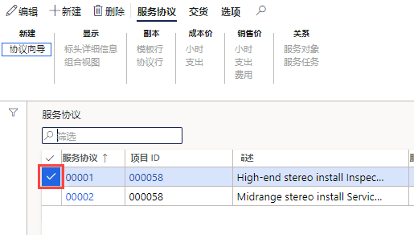
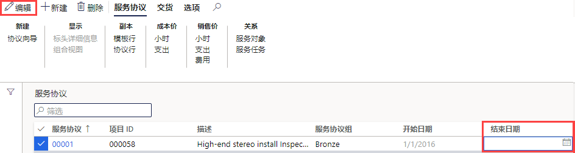

---
lab:
    title: '实验室 7： 创建计划的工作订单'
    module: '模块 1： 学习 Microsoft Dynamics 365 Supply Chain Management 的基础知识'
---

## 实验室 7 - 创建计划的工作订单

## 目标

系统中的维护订单描述了资产所需的维护或修理，用于分配合适的资源来完成维护请求。你的公司有一个持续的服务合同，需要确保创建计划的服务订单以支持合同项目的预期服务。

## 实验室设置

   - **预计用时**： 10 分钟

## 说明

1. 在财务和运营主页的右上角，验证你当前是否在对 USMF 公司执行操作。

1. 如有必要，请选择公司，然后从菜单中选择 **“USMF”**。

1. 在左侧的导航窗格中，选择 **“模块”** > **“服务管理”** > **“服务协议”** > **“服务协议”**。

1. 选择第一个服务协议第一列中的复选框。

    

1. 选择 **“结束日期”** 框，删除当前值，然后在顶部菜单上选择 **“保存”**。  
 删除结束日期是为了可以为此协议创建新的服务订单。

    

1. 在顶部菜单中，选择 **“交货”**。

1. 在功能区栏的 **“创建”** 下，选择 **“计划服务订单”**。

1. 在“创建服务订单”窗格的 **“期间”** 下，将 **“开始日期”** 设为今天的日期，将 **“结束日期”** 设为今天日期过后第 2 天的日期。

1. 在 **“信息日志”** 下，选择 **“显示信息日志”** 切换开关，将其设置为 **“是”**。  
这将显示在协议中创建的服务订单的列表。

1. 在 **“包括交易记录类型”** 下，选择 **“小时”** 切换开关，将其设置为 **“是”**。  
交易类型代表在服务协议中创建的行，你选择的每个交易类型都会产生数个服务订单，具体取决于服务协议行上指定的服务间隔。

1. 在 **“选项”** 下，选择 **“连续”** 切换开关，将其设置为 **“是”**。  
这用于创建任何在连续系列服务订单中缺失的服务订单。

1. 选择 **“确定”**。
